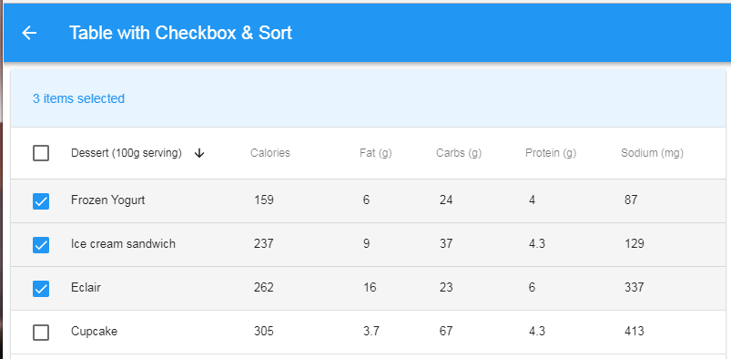

# f7-table Component
component of Framework7 table for Vue.js, including Pagination, Sorting, Selection, customized cell action

Snap-shot:
> 





Live demo: https://ourbits.herokuapp.com/f7-table

## Features
One line to create table:
```
<f7-table :fields="fields" :querydata="querydata" @pageChange="query_data_from_api()">
</f7-table>
```

## Usage
1) setup you framework7 (v2) + vue project.
Here's one kind of template: https://github.com/kevinqqnj/Framework7-Vue-Webpack-Template-v2
2) copy `src/components/f7-table.vue` to your project
3) import it as component in .vue `script`. e.g.
```
<script>
export default {
    components: {
        "f7-table": require('../components/f7-table.vue'),
    },
    ...
```
4) use component in .vue `template`. For startup, you only need to provide `:fields` & `:querydata`.
```
# /src/pages/basic-table.vue
<f7table :fields="fields" :querydata="querydata">
    <!-- slot: data-table-header-selected -->
    <!-- thead -->
    <!-- tbody -->
    <!-- slot: rows -->
</f7table>
```

## How to run demo
- git clone https://github.com/kevinqqnj/f7-table.git
- npm install
- npm run dev

That's it!

## Advanced
###Props:
1) Show checkbox at first column:
```
# /src/pages/checkbox-table.vue
:__checkbox="true"
```
2) use your own `sortOrders` data:
```
:sortOrders.sync="sortOrders"
```
2) use your own `per_page` data:
```
:per_page.sync="per_page"
```
###Events:
1) @pageChange: listen to page-change event, then fetch new data from server
```
@pageChange="query_data_from_api()"
```
2) @orderChange: listen to sort-order-change event, then fetch new data from server
```
@orderChange="query_data_from_api()"
```
### customeize rows
You can easily define your actions on different cells, e.g. open "Edit" popover, link to other page, etc.
Full usage is like this:
```
# /src/pages/cell-action-table.vue
<f7table :fields="fields" :querydata="querydata" :__checkbox="true" :sortOrders.sync="sortOrders" :per_page.sync="per_page" @orderChange="query_data_from_api()" @pageChange="query_data_from_api()">
    <div slot="data-table-header-selected" class="data-table-header-selected">
	...
    <!-- thead -->
    <!-- tbody -->
    <tr slot="rows" slot-scope="props">
	...
</f7table>
```

### fetch data from Server
The table shows data from 'querydata', it can be fetched from server side, format is like:
```
# /src/querydata.js
const querydata = {
  "data": [
          {
            name: 'Frozen Yogurt',
            calories: 159,
            fat: 6.0,
            carbs: 24,
            protein: 4.0,
            sodium: 87,
            calcium: '14%',
            iron: '1%'
          },
 	...
        ], 
  "current_page": 1, 
  "from": 1, 
  "last_page": 12, 
  "per_page": 10, 
  "to": 10, 
  "total": 245
}
```

